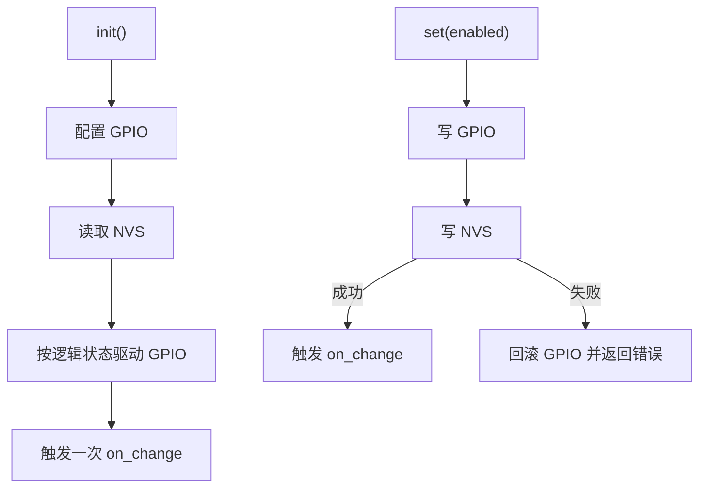

# nvs_gpio_output

带 NVS 持久化的输出 GPIO。把"一个输出脚 + 掉电保持的逻辑状态 + 变更通知"这一通用能力从具体外设中抽离出来，可用于任意需要上电恢复状态的使能脚（如总线终端电阻、外设供电使能等）。

## 模块特点

- **通用**：与具体外设无关，NVS key、极性、默认值在构造时配置，引脚在 `init()` 时传入
- **多实例**：每个实例持有独立的引脚、NVS key 和回调，互不影响
- **掉电保持**：逻辑状态写入 NVS，`init()` 时自动恢复
- **写失败回滚**：NVS 持久化失败时回滚 GPIO 电平并返回错误，避免"假成功"
- **极性可配**：`active_high=false` 时逻辑状态与物理电平反相

## 状态流程



## 集成与使用

```cpp
#include "nvs_gpio_output.h"

static NvsGpioOutput term_resistor("can_term", false, true);

void app_main() {
    term_resistor.set_on_change_callback([](bool on) {
        ESP_LOGI("APP", "terminal resistor %s", on ? "ON" : "OFF");
    });
    ESP_ERROR_CHECK(term_resistor.init(GPIO_NUM_16));
    ESP_ERROR_CHECK(term_resistor.toggle());
}
```

## API 参考

| API | 说明 |
|-----|------|
| `NvsGpioOutput(nvs_key, default_state = false, active_high = true)` | 构造实例，绑定 NVS key、默认值与极性 |
| `init(gpio)` | 配置输出引脚并恢复 NVS 中的逻辑状态 |
| `set(enabled)` | 设置逻辑状态并持久化，失败回滚 |
| `toggle()` | 翻转逻辑状态并持久化 |
| `get()` | 获取当前逻辑状态 |
| `set_on_change_callback(callback)` | 状态变化回调（含 `init()` 恢复时触发一次） |

## 构造参数

| 参数 | 类型 | 默认 | 说明 |
|------|------|------|------|
| `nvs_key` | `const char*` | — | NVS key，最长 15 字节，超长截断并告警；生命周期需覆盖对象 |
| `default_state` | `bool` | `false` | NVS 无记录时的默认逻辑状态 |
| `active_high` | `bool` | `true` | `true` 逻辑 1 输出高电平；`false` 反相 |

## 注意事项

- 所有实例共享同一 NVS 命名空间（由 `HXC_NVS` 管理），通过不同 `nvs_key` 区分
- 持久化失败会回滚 GPIO，但**不会**触发 `on_change` 回调，调用方应以返回值为准
- 未 `init()` 时 `set/toggle` 返回 `ESP_ERR_INVALID_STATE`，`get()` 返回 `false`

## 环境与依赖

- **软件**：ESP-IDF v6.0+、C++20

<!-- dependency-links:start -->
## 依赖导航

工程内直接依赖：

- [`cpp_gpio_driver`](../../bsp/cpp_gpio_driver/README.md)（`bsp`）
- [`HXC_NVS`](../../bsp/HXC_NVS/README.md)（`bsp`）

> 本节按当前 `CMakeLists.txt` 的 `REQUIRES` / `PRIV_REQUIRES` 维护。
<!-- dependency-links:end -->
